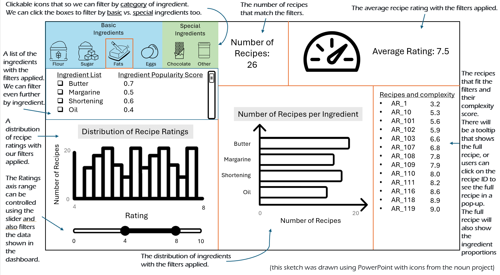

# Milestone 1 Report
Authors: Mu (Henry) Ha, Javier Martinez, Stephanie Ta, and Zuer (Rebecca) Zhong

## Motivation and Purpose

## Description of the Data

## Research Questions and Usage Scenarios

## App Sketch & Brief Description

The app has a landing page that shows the distribution of cookie recipe ratings as a histogram and the
distribution of the different recipe ingredients as a bar chart.
The number of recipes and average recipe rating will also be displayed.
From the clickable boxes, the user can filter by overall category (basic or special ingredient).
They can filter even further by the ingredient subcategories (Flour, Sugar, Fats, Eggs, Chocolate, and Other) by clicking on the icons.
Additionally, they can filter by specific ingredient from the list of ingredients.
There is also a slider that will allow the user to filter by their desired recipe rating range.

